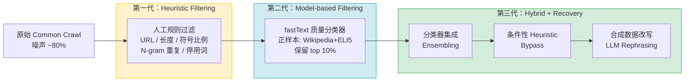

# FineWeb Pipeline：预训练数据清洗三代方法论对比实践

> 在同一份 Common Crawl 数据上，依次实现并量化对比 Heuristic Filtering、Model-based Filtering、Hybrid Pipeline 三代方法论，产出完整的 quality-quantity trade-off 分析报告。

---

## 数据清洗在完整预训练 Pipeline 中的位置

```
原始 Common Crawl
      │
      ▼
 文本提取（Trafilatura / Justext）
      │
      ▼
 ┌─────────────────────────────┐
 │    清洗过滤（本项目重点）     │
 │  Gen1: Heuristic Filtering  │
 │  Gen2: Model-based          │
 │  Gen3: Hybrid + Recovery    │
 └─────────────────────────────┘
      │
      ▼
 去重（精确 MD5 + MinHash LSH）
      │
      ▼
 数据配比混合（Data Mixing）
 Web 50% + Code 25% + 学术 15% + Wiki 5% + 其他 5%
 （如 Llama 3 的配比，本项目聚焦清洗和去重）
      │
      ▼
 预训练（Proxy Model 验证）
```

**本项目聚焦"清洗过滤"和"去重"两步。Data Mixing 是下游环节，不在本项目范围内。**

---

## 三代方法论演进



| | 第一代（Heuristic） | 第二代（Model-based） | 第三代（Hybrid） |
|---|---|---|---|
| 代表论文 | FineWeb, C4, Gopher | DCLM (NeurIPS 2024) | Nemotron-CC (NVIDIA 2024) |
| 核心方法 | 人工规则 | fastText 分类器 + top 10% | 分类器集成 + Bypass + 改写 |
| 数据保留率 | 30-40% | **10%** | **40%**（同等质量） |
| MMLU（7B） | ~55% | **~64%**（+9%） | **~69%**（+5%） |
| 核心缺陷 | 无法评估语义质量 | 90% 数据被丢弃 | API 成本较高 |
| 适用场景 | 快速基线 | 短 token horizon（<5T） | 长 token horizon（15T+） |

---

## 核心结论（占位符，运行后填入）

```
┌─────────────────────────────────────────────────────────┐
│  三代方法论对比结果（Full Run，50K 文档）                  │
├──────────────┬─────────┬─────────┬─────────┬───────────┤
│ 指标          │ 原始数据 │ 第一代  │ 第二代   │ 第三代    │
├──────────────┼─────────┼─────────┼─────────┼───────────┤
│ 文档保留率    │ 100%    │ ~35%   │ ~10%    │ ~38%      │
│ Quality Score │ --      │ --     │ --      │ --        │
│ LIFT vs 原始  │ -       │ --     │ --      │ --        │
│ 3-gram 多样性 │ --      │ --     │ --      │ --        │
│ Token 数量    │ --      │ --     │ --      │ --        │
└──────────────┴─────────┴─────────┴─────────┴───────────┘
```

---

## 项目结构

```
fineweb-pipeline/
├── configs/          # 统一配置（run_mode 切换 + pipeline 参数）
├── data/             # 数据目录（不入 git）
├── docs/             # FAQ、交互记录等文档
├── notebooks/        # 10 个 Jupyter Notebook（理论 + 实验）
├── src/
│   ├── gen1/         # 第一代：Heuristic Filtering（英文）
│   ├── gen1_zh/      # 第一代：中文专用 Pipeline
│   ├── gen2/         # 第二代：Model-based Filtering
│   ├── gen3/         # 第三代：Hybrid Pipeline
│   ├── dedup/        # 去重（精确 + MinHash）
│   ├── evaluation/   # 统一评估体系（独立于 pipeline）
│   ├── proxy_model/  # Proxy Model 评估器（阶段四）
│   └── utils/        # 公共工具（config_loader, tokenizer...）
├── scripts/          # 可直接运行的 pipeline 脚本
└── results/          # 输出结果（图表、报告、模型）
```

---

## 快速开始

```bash
# 1. 安装环境（约 5-10 分钟）
bash setup.sh

# 2. 激活环境
source .venv/bin/activate

# 3. 下载样本数据（约 10-20 分钟）
bash scripts/download_sample.sh

# 4. 验证全流程（smoke_test：约 10-15 分钟）
python scripts/run_gen1.py
python scripts/run_gen2.py
python scripts/run_gen3.py

# 5. 切换到 full_run（修改 configs/run_config.yaml）
# run_mode: "full_run"
python scripts/run_gen1.py && python scripts/run_gen2.py && python scripts/run_gen3.py

# 6. 启动 Jupyter 查看 Notebook
jupyter lab notebooks/
```

---

## Notebook 导航

| Notebook | 内容 | 类型 |
|---|---|---|
| `00_methodology_overview` | 三代方法论演进 + 核心术语表 | 理论 |
| `01_data_exploration` | 原始数据探索 + 基准线建立 | 分析 |
| `02_gen1_heuristic_filtering` | 第一代 7 个过滤器逐一拆解 | 实验 |
| `03_gen2_model_based_filtering` | fastText 分类器 + 阈值实验 | 实验 |
| `04_gen3_hybrid_pipeline` | 集成 + Bypass + 改写 | 实验 |
| `05_deduplication_analysis` | 精确去重 + MinHash 原理与实验 | 实验 |
| `06_cross_generation_comparison` | **三代对比 Dashboard（核心）** | 报告 |
| `07_ablation_study` | 消融实验：哪个组件最关键 | 分析 |
| `08_chinese_extension` | 中文场景适配与挑战 | 扩展 |
| `09_proxy_model_validation` | 端到端验证（可选进阶） | 验证 |

> 📖 常见问题参见 [docs/FAQ.md](docs/FAQ.md)

---

## 数据规模配置

在 `configs/run_config.yaml` 中切换：

```yaml
run_mode: "smoke_test"  # 1000 文档，10-15 分钟验证无报错
# run_mode: "full_run"  # 50000 文档，2-3 小时产出正式结果
```

---

## API 配置（第三代 LLM 改写）

```yaml
# configs/api_config.yaml
provider: "anthropic"
api_key: "YOUR_API_KEY_HERE"  # 或通过环境变量 FINEWEB_API_KEY 设置
```

---

## 参考资料

| 资源 | 链接 |
|---|---|
| datatrove（核心框架） | https://github.com/huggingface/datatrove |
| FineWeb 数据集 | https://huggingface.co/datasets/HuggingFaceFW/fineweb |
| DCLM 论文（NeurIPS 2024） | https://arxiv.org/abs/2406.11794 |
| Nemotron-CC 论文 | https://arxiv.org/abs/2412.02595 |
| NeMo Curator | https://github.com/NVIDIA/NeMo-Curator |
| MIT CSAIL DCAI 课程 | https://dcai.csail.mit.edu/ |

---

*由 Claude Code 辅助实现。方法论对标业界 2024 年最新 Pre-train 数据工程实践。*
