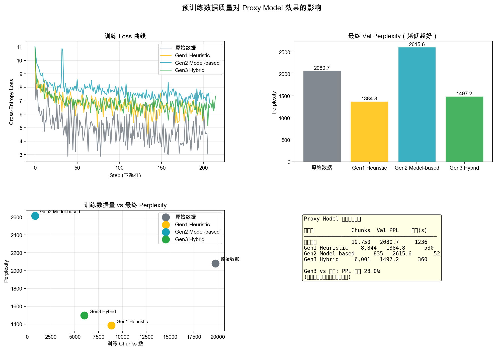

# Phase 4: Proxy Model 端到端验证报告

生成时间: 2026-03-08 19:10:21

## 1. 实验设置

| 参数 | 值 |
|---|---|
| 模型架构 | GPT-2 125M (12L/12H/768E) |
| 模型参数 | 124.0M |
| 训练数据集 | raw, gen1, gen2, gen3 |

## 2. 训练结果

| 数据集 | 训练 Chunks | 最终 Val Loss | 最终 Val PPL | 训练时长 |
|---|---|---|---|---|
| raw | 19,750 | 7.6405 | 2080.7 | 1236s |
| gen1 | 8,844 | 7.2333 | 1384.8 | 530s |
| gen2 | 835 | 7.8693 | 2615.6 | 52s |
| gen3 | 6,001 | 7.3113 | 1497.2 | 360s |

## 3. Benchmark 结果

| 数据集 | Val Perplexity | 说明 |
|---|---|---|
| raw | N/A |  |
| gen1 | N/A |  |
| gen2 | N/A |  |
| gen3 | N/A |  |

## 4. 关键发现

- **数据质量提升**：Gen3 vs 原始数据，Val PPL 降低 **28.0%**

- **数据量对比**：Gen3 保留了原始数据的 **30.4%** 训练 chunks

- **结论**：更少但更高质量的数据（Gen3 Hybrid）训练出了更好的模型

## 5. 可视化

## 6. 进一步探索

- 切换到 `full_run` 模式（`configs/run_config.yaml`）获得更多数据

- 安装 `lm-eval` 进行 HellaSwag / ARC-Easy 等任务评估

- 尝试更长训练（`--epochs 3`）观察收敛差异

- 参考 Notebook `06_cross_generation_comparison.ipynb` 中的 Proxy Model 跨代比较章节进行深度分析
