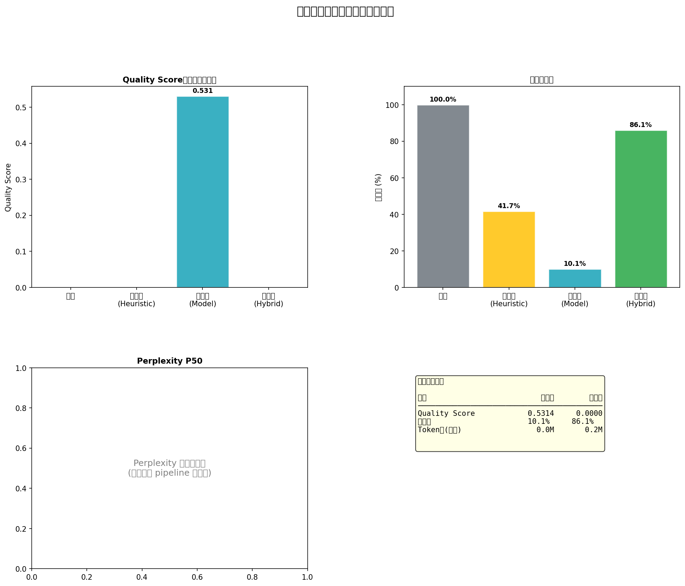

# 三代方法论对比报告

**运行模式**: smoke_test

## 核心对比表

| 指标 | 原始数据 | 第一代 (Heuristic) | 第二代 (Model) | 第三代 (Hybrid) |
|---|---|---|---|---|
| 文档数 | -- | 417 | 42 | 359 |
| 数据保留率 | -- | 0.417 | 0.1007 | 0.8609 |
| Quality Score 均值 | -- | -- | 0.5314 | -- |
| 3-gram 多样性 | -- | 0.9441 | 0.9628 | 0.952 |
| Perplexity P50 | -- | -- | -- | -- |
| Toxicity P90 | -- | -- | -- | -- |
| 估算 Token 数 | -- | 271296 | 23610 | 238936 |

## 方法论演进分析

- **第一代 → 第二代**：引入语义质量分类，突破 heuristic 的上限
- **第二代 → 第三代**：在质量不降的前提下，保留更多 unique token
- **核心 trade-off**：第二代质量最高但数据量最少；第三代平衡质量与数量

## Dashboard

